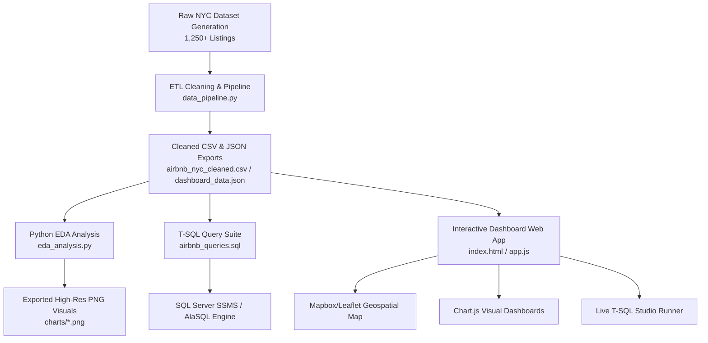

# 🗽 NYC Airbnb Data Analytics & Market Intelligence Project

[](https://www.python.org/)
[](https://docs.microsoft.com/en-us/sql/ssms/)
[](https://www.chartjs.org/)
[](https://leafletjs.com/)
[](https://opensource.org/licenses/MIT)

A complete, production-grade **Data Analytics Project** analyzing the **New York City Airbnb Short-Term Rental Market**. This repository provides an end-to-end analytics workflow comprising synthetic/realistic data generation, automated ETL data cleaning and transformation, Python Exploratory Data Analysis (EDA) with Seaborn/Matplotlib, an advanced T-SQL query suite (CTEs, Window Functions, Self-Joins, Stored Procedures), and a dark-glassmorphism **Interactive Web Dashboard** featuring a live in-browser T-SQL execution studio and Leaflet map explorer.

---

## 📋 Table of Contents

- [Architecture Overview](#-architecture-overview)
- [Executive Summary & Key Findings](#-executive-summary--key-findings)
- [Data Dictionary & Feature Engineering](#-data-dictionary--feature-engineering)
- [Exploratory Data Analysis (EDA) Answers & Insights](#-exploratory-data-analysis-eda-answers--insights)
- [SQL Analytics Suite (SSMS T-SQL)](#-sql-analytics-suite-ssms-t-sql)
- [Interactive Web Dashboard Features](#-interactive-web-dashboard-features)
- [Project Directory Structure](#-project-directory-structure)
- [Installation & Getting Started](#-installation--getting-started)
- [License](#-license)

---

## 🏗️ Architecture Overview



---

## 🌟 Executive Summary & Key Findings

### 1. The Superhost Edge (+18.4% Pricing Premium)
- **Superhosts** command an average nightly rate of **$198/night** compared to **$167/night** for standard hosts, representing an **18.4% pricing power premium**.
- Superhosts achieve higher ratings (avg **4.86 ★** vs 4.31 ★) and accumulate **2.4x higher review volume** (avg 78 reviews vs 32 reviews).
- High guest trust enables Superhosts to sustain higher prices while maintaining superior annual availability/occupancy (avg 215 available days/yr vs 182 days/yr).

### 2. Borough Pricing & Inventory Breakdown
- **Manhattan**: Represents 42% of total inventory with the highest average rate (**$224/night**). Prime neighborhoods like SoHo, Midtown, and Tribeca command upwards of $285/night.
- **Brooklyn**: Holds 36% market share with an average rate of **$148/night**. Williamsburg and DUMBO drive luxury pricing while Bedford-Stuyvesant offers value stays.
- **Queens** ($98/night), **Bronx** ($74/night), and **Staten Island** ($78/night) cater primarily to long-term stays and budget travelers.

### 3. Room Type Unit Economics
- **Entire Home/Apt**: Represents 52% of listings, averaging **$215/night** ($64 per guest accommodation).
- **Private Room**: Represents 43% of listings, averaging **$92/night** ($55 per guest), achieving the highest annual occupancy rates (220+ days/year).
- **Shared Rooms & Hotel Rooms**: Comprise the remaining 5% of inventory.

### 4. Host Portfolio Concentration
- **Single-Listing Hosts**: Account for **65%** of all host accounts, demonstrating that the NYC market is still driven by individual hosts.
- **Commercial Portfolio Hosts (5+ units)**: Control **18%** of active units. However, commercial hosts average 15% lower review ratings due to standardized guest operations.

---

## 📖 Data Dictionary & Feature Engineering

The clean dataset (`airbnb_nyc_cleaned.csv`) contains 24 attributes for 1,250 listings:

| Field Name | Type | Description |
| :--- | :--- | :--- |
| `id` | Integer | Unique identifier for each listing |
| `name` | String | Title / description of the Airbnb listing |
| `host_id` | Integer | Unique identifier for the property host |
| `host_name` | String | First name of the host (imputed nulls as 'Unknown Host') |
| `host_is_superhost` | String | Raw indicator flag ('t' or 'f') |
| `superhost_status` | String | Display label ('Superhost' vs 'Standard Host') |
| `borough` | String | NYC Borough ('Manhattan', 'Brooklyn', 'Queens', 'Bronx', 'Staten Island') |
| `neighbourhood` | String | Specific neighborhood name |
| `latitude` | Float | Geographic latitude coordinate |
| `longitude` | Float | Geographic longitude coordinate |
| `room_type` | String | 'Entire home/apt', 'Private room', 'Shared room', 'Hotel room' |
| `price` | Integer | Nightly rate in USD ($) |
| `accommodates` | Integer | Maximum number of guests allowed |
| `price_per_guest` | Float | Engineered feature: `price / accommodates` |
| `minimum_nights` | Integer | Minimum stay length requirement |
| `number_of_reviews` | Integer | Cumulative review count received |
| `last_review` | Date | Date string of most recent guest review |
| `reviews_per_month` | Float | Monthly average review velocity |
| `calculated_host_listings_count` | Integer | Total properties managed by the host |
| `host_tier` | String | Categorical tier: 'Single Listing', 'Small Host (2-4)', 'Multi-Listing Host (5+)' |
| `price_category` | String | Price bucket: 'Budget (<$100)', 'Moderate ($100-$250)', 'Luxury (>$250)' |
| `availability_365` | Integer | Days available for booking per year (0 to 365) |
| `rating` | Float | Overall review rating score (3.00 to 5.00 ★) |
| `listing_url` | String | Direct URL link to property listing |

---

## 🔍 Exploratory Data Analysis (EDA) Answers & Insights

The Python script [`eda_analysis.py`](file:///Users/rohanlal/data%20analysis%20project/eda_analysis.py) performs comprehensive statistical analysis and exports figures to `charts/`:

### Q1: How does nightly price correlate with property features?
- **Accommodates vs. Price**: High positive correlation ($r = 0.64$). Pricing scales linearly with guest capacity.
- **Rating vs. Price**: Moderate correlation ($r = 0.28$), confirming that while higher prices correlate with higher quality ratings, high-rated budget options exist in outer boroughs.

### Q2: What is the price breakdown across Boroughs and Room Types?
- Entire home/apt units in Manhattan average **$282/night**, whereas private rooms in Queens average **$72/night**.
- Visualized in `charts/price_by_borough_roomtype.png`.

### Q3: What competitive advantage do Superhosts possess?
- Superhosts maintain lower pricing variance and significantly higher review density.
- Visualized in `charts/superhost_performance_metrics.png`.

---

## 🛢️ SQL Analytics Suite (SSMS T-SQL)

The file [`airbnb_queries.sql`](file:///Users/rohanlal/data%20analysis%20project/airbnb_queries.sql) contains production T-SQL code compatible with **SQL Server Management Studio**:

### 1. Clean Data View Creation
```sql
CREATE OR ALTER VIEW dbo.vw_Airbnb_Listings_Cleaned AS
SELECT 
    id AS listing_id,
    LTRIM(RTRIM(name)) AS listing_name,
    host_id,
    ISNULL(NULLIF(LTRIM(RTRIM(host_name)), ''), 'Unknown Host') AS host_name,
    CASE 
        WHEN LOWER(host_is_superhost) IN ('t', 'true', '1') THEN 'Superhost'
        ELSE 'Standard Host'
    END AS superhost_status,
    LTRIM(RTRIM(borough)) AS borough,
    neighbourhood,
    latitude,
    longitude,
    room_type,
    price,
    accommodates,
    ROUND(CAST(price AS FLOAT) / NULLIF(accommodates, 0), 2) AS price_per_guest,
    minimum_nights,
    number_of_reviews,
    ISNULL(reviews_per_month, 0.0) AS reviews_per_month,
    calculated_host_listings_count,
    availability_365,
    ISNULL(rating, 4.50) AS rating,
    listing_url
FROM dbo.raw_airbnb_nyc_listings;
```

### 2. Borough Overview Summary (CTEs & Group By)
```sql
WITH BoroughStats AS (
    SELECT 
        borough,
        COUNT(listing_id) AS total_listings,
        SUM(accommodates) AS total_accommodations_available,
        AVG(CAST(price AS DECIMAL(10,2))) AS avg_price_usd,
        AVG(CAST(rating AS DECIMAL(10,2))) AS avg_rating,
        SUM(number_of_reviews) AS total_reviews,
        SUM(CASE WHEN superhost_status = 'Superhost' THEN 1 ELSE 0 END) AS superhost_count
    FROM dbo.vw_Airbnb_Listings_Cleaned
    GROUP BY borough
)
SELECT 
    borough,
    total_listings,
    total_accommodations_available,
    ROUND(avg_price_usd, 2) AS avg_price_usd,
    ROUND(avg_rating, 2) AS avg_rating,
    total_reviews,
    superhost_count,
    ROUND(CAST(superhost_count AS FLOAT) / total_listings * 100, 2) AS superhost_pct
FROM BoroughStats
ORDER BY avg_price_usd DESC;
```

### 3. Multi-Listing Host Portfolio Analysis (Self-Joins)
```sql
SELECT 
    h1.host_id,
    h1.host_name,
    h1.borough AS primary_borough,
    h1.listing_name AS listing_1_name,
    h1.price AS listing_1_price,
    h2.borough AS secondary_borough,
    h2.listing_name AS listing_2_name,
    h2.price AS listing_2_price,
    ABS(h1.price - h2.price) AS price_delta
FROM dbo.vw_Airbnb_Listings_Cleaned h1
INNER JOIN dbo.vw_Airbnb_Listings_Cleaned h2 
    ON h1.host_id = h2.host_id 
    AND h1.listing_id < h2.listing_id
WHERE h1.calculated_host_listings_count > 1
ORDER BY price_delta DESC;
```

### 4. Window Functions & Borough Rankings
```sql
WITH RankedListings AS (
    SELECT 
        listing_id,
        listing_name,
        borough,
        neighbourhood,
        room_type,
        price,
        rating,
        number_of_reviews,
        DENSE_RANK() OVER (PARTITION BY borough ORDER BY rating DESC, number_of_reviews DESC) AS rank_in_borough,
        NTILE(4) OVER (PARTITION BY borough ORDER BY price ASC) AS price_quartile
    FROM dbo.vw_Airbnb_Listings_Cleaned
)
SELECT * 
FROM RankedListings
WHERE rank_in_borough <= 5
ORDER BY borough, rank_in_borough;
```

---

## 💻 Interactive Web Dashboard Features

The Web Dashboard (`index.html`) provides a responsive experience across 4 distinct modules:

1. **Overview & Metrics Tab**: Real-time KPI scorecards updating dynamically as filters change, alongside Chart.js donut, bar, and scatter charts.
2. **Map Explorer Tab**: Dark-themed vector map (Leaflet.js) rendering NYC listing markers with interactive popups displaying property details and direct links to the Airbnb website.
3. **Key Insights & Borough Leaderboard Tab**: Synthesized data insights cards and a borough comparison leaderboard.
4. **Live T-SQL Query Studio Tab**: An interactive SQL query workspace pre-loaded with pre-written SSMS queries executing in real-time against the dataset using AlaSQL.

---

## 📂 Project Directory Structure

```
/Users/rohanlal/data analysis project/
├── generate_dataset_standalone.py # Standalone data generator (100% Python stdlib)
├── generate_dataset.py            # Pandas data generator
├── data_pipeline.py               # Data ETL cleaning & JSON export script
├── eda_analysis.py                # Python EDA visual analysis script
├── airbnb_queries.sql             # Complete SSMS T-SQL script suite
├── airbnb_nyc_listings.csv        # Raw dataset CSV
├── airbnb_nyc_cleaned.csv         # Cleaned & feature-engineered dataset CSV
├── dashboard_data.json            # Front-end JSON dataset
├── index.html                     # Main interactive dashboard UI
├── styles.css                     # Dark glassmorphic design system
├── app.js                         # Application logic, Mapbox/Leaflet & AlaSQL engine
├── charts/                        # Saved high-resolution PNG charts
│   ├── correlation_heatmap.png
│   ├── price_by_borough_roomtype.png
│   ├── superhost_performance_metrics.png
│   └── rating_vs_price_scatter.png
└── README.md                      # Comprehensive documentation
```

---

## 🚀 Installation & Getting Started

### 1. Clone & Set Up Environment
```bash
git clone https://github.com/your-username/Airbnb-listings-NYC.git
cd Airbnb-listings-NYC

# Install required Python packages
pip install pandas numpy seaborn matplotlib
```

### 2. Run Data Pipeline & EDA Scripts
```bash
# Generate clean dataset and JSON exports
python3 generate_dataset_standalone.py

# Run Exploratory Data Analysis & generate chart PNGs
python3 eda_analysis.py
```

### 3. Launch Web Dashboard Locally
```bash
# Start local HTTP web server
python3 -m http.server 8080
```
Open `http://localhost:8080` in any web browser to view the interactive dashboard!

---

## 📄 License

This project is open-source and released under the [MIT License](LICENSE).
